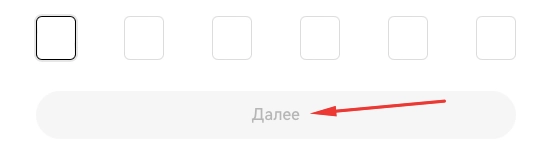

# OKX Crypto Exchange – Complete Platform Guide for Trading and Registration

Looking for a reliable crypto trading platform that combines ease of use with professional tools? OKX offers comprehensive trading features, low fees, and access to 180+ countries. Whether you're new to crypto or an experienced trader, this guide walks you through everything from registration to your first trade—no complicated jargon, just practical steps to get started.

---

OKX stands as one of the most established crypto exchanges, having launched back in 2013. What started as a simple exchange platform has evolved into a comprehensive ecosystem serving millions of users worldwide. The developers describe it as an innovative platform opening doors to financial opportunities across 180 countries.

What makes OKX appealing is its straightforward approach. You don't need to juggle multiple exchange accounts just to access different assets—everything's available in one place. It's like having a well-stocked toolbox instead of running to different stores for each tool you need.

## Platform Features and Functionality

OKX caters to both beginners taking their first steps and advanced users seeking sophisticated trading options. Here's what the platform offers:

The exchange sports a modern multilingual website plus convenient mobile apps for trading on the go. Users can work with crypto, fiat currency, NFTs, futures, options, and perpetual swaps—basically covering the full spectrum of digital asset trading.

Beyond the core trading platform, you'll find a mobile wallet, trading bots for automation, quick conversion tools, P2P trading for direct peer-to-peer transactions, staking opportunities, and educational materials to level up your knowledge.

The platform supports DeFi application integration, giving you access to decentralized finance protocols. There's also a referral program where you can earn up to 50% commission from referred users' trading fees, plus additional cash prizes and bonuses.

Fee structure follows a maker/taker model with low fixed rates. VIP users and OKX token holders get even better rates—a nice perk for active traders or platform supporters.

Customer support operates 24/7, which matters when you're dealing with volatile markets that never sleep.

## Registration and Account Setup

Getting started with 👉 [OKX requires a standard registration process that takes just a few minutes](https://www.okx.com/join/47044926). Head to the main page and click the "Create Account" button in the top menu.

You'll need to enter your email address and optionally add a referral code. Then hit "Create Account" to proceed.

Check your inbox for a verification code, enter it in the corresponding field, and click "Next."

Next comes phone number verification—same drill, enter your number and confirm it with the code you receive.

Select your country of residence from the list, tick the boxes agreeing to the exchange's terms and privacy policy, then click "Next."

Finally, create a strong password. Registration complete—you're now in. Save that password somewhere secure, because losing access to your account over a forgotten password is unnecessarily frustrating.

For full platform access, you'll need identity verification. You've already confirmed your email and phone during signup—next is filling out your profile details. Start the process right from your dashboard homepage by clicking "Complete Verification."

For personal accounts, choose "Individual Verification" and click "Verify Identity." The platform will walk you through the requirements—review them and proceed with the process.

Select your country and document type, then click "Next."

If you're on desktop, you'll scan a QR code to continue on your smartphone. You'll take a selfie and photograph your ID document. Additionally, you'll complete a form with personal details and upload proof of address documentation. Verification typically processes within 24 hours.

## Making Your First Trade

Once verified, you're ready to trade. First, deposit funds through the "Assets" tab using the "Deposit" function. The page displays available currencies—select yours, and the system generates a deposit address. Transfer funds using your preferred method.

For straightforward crypto trades, use the spot trading section. Navigate to "Trade," select "Spot," then use the search bar to find your desired trading pair.

Scroll down to see buy and sell order options. Specify order type, enter the amount of cryptocurrency to purchase, set your price if needed, then hit "Buy" and wait for order execution.

To withdraw funds from your exchange account to an external wallet, go to "Assets," select "Withdraw," specify the balance, amount, and destination address.

## User Feedback and Platform Reputation

OKX generates significant discussion online, with its reach extending well beyond crypto enthusiast circles. The platform maintains solid reputation among both experienced traders and newcomers.

Some users aren't thrilled about mandatory verification, but here's the reality: all major centralized exchanges now require it. It's the trade-off for regulatory compliance and enhanced security features.

If you haven't found your ideal trading platform yet, 👉 [OKX's toolkit might be exactly what you're looking for—offering the stability of an established exchange with modern features that actually make trading more accessible](https://www.okx.com/join/47044926).

---

**Bottom line:** OKX combines a decade of operational experience with contemporary trading tools, serving users across 180 countries with competitive fees and comprehensive asset coverage. Whether you're just starting your crypto journey or managing an advanced portfolio, the platform provides the infrastructure, security, and support needed for confident trading. The registration process is straightforward, verification is standard industry practice, and once you're set up, you have access to spot trading, futures, staking, and more—all from a single, well-designed platform.
